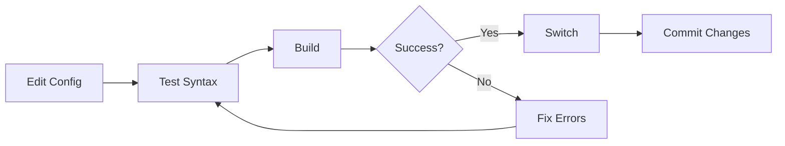

<div align="center">

```
███╗   ██╗██╗██╗  ██╗ ██████╗ ███████╗
████╗  ██║██║╚██╗██╔╝██╔═══██╗██╔════╝
██╔██╗ ██║██║ ╚███╔╝ ██║   ██║███████╗
██║╚██╗██║██║ ██╔██╗ ██║   ██║╚════██║
██║ ╚████║██║██╔╝ ██╗╚██████╔╝███████║
╚═╝  ╚═══╝╚═╝╚═╝  ╚═╝ ╚═════╝ ╚══════╝
```

# 🚀 NixOS Configuration

### *Declarative, Reproducible, Modular System Configuration*

[](https://nixos.org)
[](https://opensource.org/licenses/MIT)
[](https://nixos.wiki/wiki/Flakes)

Personal NixOS system configuration using **Flakes** for reproducible declarative system management  
Optimized for **Intel i5-11400F** + **NVIDIA RTX 3060 Ti** gaming & development workstation

[Features](#️-features) • [Quick Start](#-quick-start) • [Architecture](#️-architecture) • [Workflow](#-workflow) • [Troubleshooting](#️-troubleshooting)

---

</div>

## 🏗️ Architecture

```
.
├── flake.nix                    # Flakes entry point & module composition
├── configuration.nix            # Main system configuration
├── hardware-configuration.nix   # Hardware-specific settings (auto-generated)
├── justfile                     # Automation recipes (build, switch, etc.)
└── modules/
    ├── core/                    # System core settings
    │   ├── boot.nix            # systemd-boot, GRUB configuration
    │   ├── graphics.nix        # X11, NVIDIA driver
    │   ├── system.nix          # Locale, timezone, hostname
    │   └── users.nix           # User management
    ├── desktop/                 # Desktop environment
    │   ├── plasma.nix          # KDE Plasma 6
    │   └── sddm.nix            # Display manager
    ├── packages/                # Package sets
    │   ├── dev.nix             # Development tools (git, vscode, etc.)
    │   ├── gaming.nix          # Gaming stack (Steam, GameMode, etc.)
    │   └── system.nix          # System utilities
    └── services/                # System services
        ├── networking.nix      # Network config, DNS, TCP tuning
        └── sound.nix           # PipeWire audio

```

## 📋 Table of Contents

- [Features](#️-features)
- [Architecture](#️-architecture)
- [System Specifications](#-system-specifications)
- [Quick Start](#-quick-start)
- [Workflow](#-workflow)
- [Troubleshooting](#️-troubleshooting)
- [References](#-references)
- [Contributing](#-contributing)
- [License](#-license)

---

## ⚙️ Features

<table>
<tr>
<td width="50%">

### 🎨 Desktop Experience
- **KDE Plasma 6** with Wayland/X11
- **SDDM** display manager
- **NVIDIA** proprietary drivers
- Hardware acceleration enabled

### 🎮 Gaming Ready
- **Steam** with Proton
- **GameMode** optimization
- Custom CPU governor settings
- GPU performance tweaks

</td>
<td width="50%">

### 🛠️ Development Tools
- **VS Code** with extensions
- **Git** version control
- **Node.js** runtime
- **nixpkgs-fmt** formatter
- **nix-output-monitor**

### 🌐 Network Optimization
- **Cloudflare DNS** (1.1.1.1)
- **BBR** congestion control
- **FQ** queue discipline
- TCP tuning for performance

</td>
</tr>
</table>

### 🔑 Key Highlights

- ✅ **Fully Modular**: Organized into logical core, desktop, packages, and services modules
- ✅ **Declarative**: Everything defined in code - no manual configuration drift
- ✅ **Reproducible**: Same config produces same system, every time
- ✅ **Automated**: Just recipes for build, switch, rollback, and more
- ✅ **Version Controlled**: Full Git integration with flakes
- ✅ **Performance Tuned**: Optimized for gaming and development workloads

## 🚀 Quick Start

### 📋 Prerequisites

Before you begin, ensure you have:

- ✅ NixOS installed with Flakes enabled
- ✅ Git installed and configured
- ✅ Basic understanding of Nix language
- ⭐ `nh` tool (optional, for better UX)

### 🎯 Installation

```bash
# Clone this repository
git clone https://github.com/Xellor-Dev/nixos-configuration.git
cd nixos-configuration

# Review and customize configuration
# Edit modules/ files to match your system

# Build and test (doesn't apply changes)
just test

# Apply configuration
just switch
```

### ⚡ Common Commands

<table>
<tr>
<th>Command</th>
<th>Description</th>
<th>Use Case</th>
</tr>
<tr>
<td><code>just build</code></td>
<td>Build configuration without applying</td>
<td>Safe testing before switch</td>
</tr>
<tr>
<td><code>just switch</code></td>
<td>Build and apply new configuration</td>
<td>Apply your changes</td>
</tr>
<tr>
<td><code>just test</code></td>
<td>Check syntax and build</td>
<td>Validate config changes</td>
</tr>
<tr>
<td><code>just update</code></td>
<td>Update flake.lock dependencies</td>
<td>Get latest packages</td>
</tr>
<tr>
<td><code>just rollback</code></td>
<td>Revert to previous generation</td>
<td>Undo recent changes</td>
</tr>
<tr>
<td><code>just clean</code></td>
<td>Remove build artifacts</td>
<td>Free up space</td>
</tr>
<tr>
<td><code>just status</code></td>
<td>Show system information</td>
<td>Check current state</td>
</tr>
<tr>
<td><code>just diff</code></td>
<td>Compare current vs new config</td>
<td>See what will change</td>
</tr>
</table>

---

## 🖥️ System Specifications

<div align="center">

| Component | Specification |
|:---------:|:-------------:|
| 💻 **CPU** | Intel Core i5-11400F (6C/12T) |
| 🎮 **GPU** | NVIDIA GeForce RTX 3060 Ti |
| 💾 **RAM** | DDR4 (Dual Channel) |
| 🖥️ **OS** | NixOS 25.11 (Warbler) |
| 🪟 **Desktop** | KDE Plasma 6 |
| 🔊 **Audio** | PipeWire |
| 🥾 **Bootloader** | systemd-boot |
| 🎨 **Display** | NVIDIA (proprietary driver) |

</div>

### Minimum Requirements

- **NixOS** with Flakes enabled (`nix.settings.experimental-features = [ "nix-command" "flakes" ];`)
- **Git** for version control
- `nh` tool (optional, recommended for faster rebuilds)

---


---

## 🔄 Workflow

### 📝 Making Changes



### Step-by-Step Guide

1. **📝 Edit Configuration**
   ```bash
   # Modify files in modules/ directory
   vim modules/packages/system.nix
   ```

2. **✅ Test & Validate**
   ```bash
   just test
   ```

3. **🔨 Build Configuration**
   ```bash
   just build
   ```

4. **🚀 Apply Changes**
   ```bash
   just switch
   ```

5. **💾 Commit to Git**
   ```bash
   git add .
   git commit -m "feat: add new package"
   git push
   ```

### 📦 Example: Adding a Package

```nix
# modules/packages/system.nix
{ config, pkgs, ... }:

{
  environment.systemPackages = with pkgs; [
    # ... existing packages ...
    
    # Add your new package here
    htop
    neofetch
  ];
}
```

Then apply the changes:

```bash
just switch
```

---

## 🛠️ Troubleshooting

<details>
<summary><b>❌ "Path not tracked by Git" Error</b></summary>

Nix Flakes require all configuration files to be tracked by Git:

```bash
# Add all files to Git
git add .

# Commit your changes
git commit -m "update: configuration changes"
```

> 💡 **Tip**: Flakes only see committed files, not just staged ones!

</details>

<details>
<summary><b>🔙 Rollback to Previous Generation</b></summary>

If something breaks, easily rollback:

```bash
# Using just
just rollback

# Or manually
sudo nixos-rebuild switch --rollback
```

</details>

<details>
<summary><b>🔍 Check for Errors</b></summary>

Validate your configuration before applying:

```bash
# Quick syntax check
just check

# Full test build
just test

# See what will change
just diff
```

</details>

<details>
<summary><b>🐛 Build Failures</b></summary>

Common issues and solutions:

1. **Syntax Errors**: Run `just check` to validate
2. **Missing Inputs**: Ensure all files are committed to Git
3. **Package Conflicts**: Check `nix build` logs for details
4. **Network Issues**: Verify internet connection for fetching packages

</details>

<details>
<summary><b>💾 Disk Space Issues</b></summary>

Clean up old generations and garbage:

```bash
# Remove old generations
sudo nix-collect-garbage -d

# Remove build artifacts
just clean

# Optimize Nix store
nix-store --optimize
```

</details>

<details>
<summary><b>🖥️ NVIDIA Driver Issues</b></summary>

If you experience graphics issues:

```bash
# Check NVIDIA driver status
nvidia-smi

# Rebuild with new drivers
just switch

# Check Xorg logs
journalctl -b -u display-manager
```

</details>

---

## 📚 References

### 📖 Official Documentation
- [NixOS Manual](https://nixos.org/manual/nixos/stable) - Complete NixOS reference
- [Nix Package Search](https://search.nixos.org) - Find packages and options
- [Nix Flakes](https://nixos.wiki/wiki/Flakes) - Flakes guide and reference

### 🛠️ Tools & Utilities
- [nix-helper (nh)](https://github.com/viperML/nh) - Simplified NixOS rebuilds
- [Home Manager](https://github.com/nix-community/home-manager) - User environment management
- [nixpkgs-fmt](https://github.com/nix-community/nixpkgs-fmt) - Nix code formatter

### 🎓 Learning Resources
- [NixOS & Flakes Book](https://nixos-and-flakes.thiscute.world/) - Comprehensive guide
- [Nix Pills](https://nixos.org/guides/nix-pills/) - Deep dive into Nix
- [Zero to Nix](https://zero-to-nix.com/) - Beginner-friendly tutorial

### 🌟 Community
- [NixOS Discourse](https://discourse.nixos.org/) - Community forum
- [NixOS Reddit](https://www.reddit.com/r/NixOS/) - Discussion and support
- [NixOS Matrix](https://matrix.to/#/#community:nixos.org) - Real-time chat

---

## 🤝 Contributing

Contributions, issues, and feature requests are welcome!

### How to Contribute

1. 🍴 Fork this repository
2. 🌿 Create a feature branch (`git checkout -b feature/amazing-feature`)
3. 💾 Commit your changes (`git commit -m 'feat: add amazing feature'`)
4. 📤 Push to the branch (`git push origin feature/amazing-feature`)
5. 🔃 Open a Pull Request

### Commit Convention

This project follows [Conventional Commits](https://www.conventionalcommits.org/):

- `feat:` - New feature
- `fix:` - Bug fix
- `docs:` - Documentation changes
- `refactor:` - Code refactoring
- `chore:` - Maintenance tasks

---

## 💖 Acknowledgments

- **NixOS Community** for the amazing ecosystem
- **Contributors** to nixpkgs and related tools
- Everyone maintaining the packages and documentation

---

## 📄 License

This project is licensed under the MIT License - see the [LICENSE](LICENSE) file for details.

---

<div align="center">

**[⬆ Back to Top](#-nixos-configuration)**

Made with ❤️ using [NixOS](https://nixos.org)

</div>